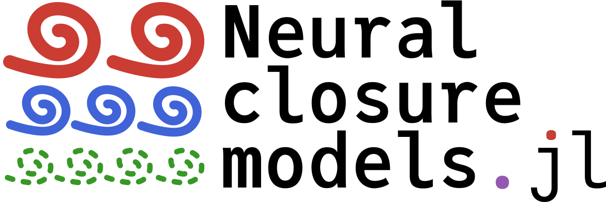

# Neural closure models

## About this repo

This repository contains the code associated with my master thesis.
It includes code for:

- Generating training data by solving PDEs/ODEs:
    - Burgers' equation
    - The Kuramoto-Sivashinsky equation
    - The Lorenz '96 model
- Training a variety of ML models on the resulting data
    - Discrete models: `u(t + Δt) = model(u(t))`
    - Neural ODEs (NODEs): `du/dt = model(u)`
    - Neural closure models: `du/dt = f(u) + model(u)`
    - Augmented Neural ODEs (ANODEs): `d/dt [u, h] = model(u, h)`
    - Discrete delay models: `u(t + Δt) = model(u(t), u(t - Δt), u(t - 2Δt), ..., u(t - kΔt))`

## Installation

0. Before cloning this repo, install [Git LFS](https://git-lfs.github.com/).
    This way, the down-sampled training data for the neural networks (~60MB) will be included in the repo.
1. Install [Julia](https://julialang.org/downloads/).
    This software was run with Julia version 1.7.3, although other 1.7.x versions should also work.
2. Install dependencies by launching `julia` in this folder:

    ```shell
    > cd neural-closure-models
    > julia --project=.
    ```

    and installing all dependencies by running:

    ```julia
    using Pkg; Pkg.instantiate()
    include("src/neural_closure_models.jl")
    ```

## Examples

The following script gives an example of loading training data, creating an ML model, training it on the data, and
showing some results. Note that as is common with Julia code, there can be a significant delay when a piece of code is
run for the first time. This is especially noticable when training models, since this requires compiling lots of code
from `Flux.jl` as well as `DifferentialEquations.jl`. However, subsequent calls to the same functions are typically
much faster.

```julia
# Load code
include("src/neural_closure_models.jl")

begin # load data
    using JLD2
    burgersdata = load("trainingdata/burgers.reduced.jld2")
    solutions = burgersdata["solutions"]
    parameters = burgersdata["parameters"]
    t⃗ = parameters.t⃗
    # Create a struct containing the relevant parameters of the equation. This struct acts as the spatially discretised
    # right-hand side, i.e. the ODE `du/dt = f(u)` is a discretisation of Burgers' equation.
    f = BurgersParams(parameters.ν, parameters.Δx)
end

begin # create a neural closure model
    nn = create_basic_nn()
    model = ClosureModel(
        nn, # neural network term
        f,  # non-neural network term
        "Basic neural closure model"
    )
end

begin # train the model for a few epochs
    validation = trajectory_rmse(
        model,                    # validate by computing root-mean-square errors
        solutions[:, :, 97:128],  # on trajectories 97 through 128 of the training data
        t⃗,                        #
        (; alg = Tsit5())         # solving the ODE using Tsit5
    )
    train_closure!(
        model, t⃗, solutions[:, :, 1:96];              # take all x-coordinates, all time stamps, and solutions 1 through 96

        # only the first three arguments are required, the remainder is optional
        exit_condition = ExitCondition(100, nothing), # 100 epochs, no early stopping
        penalty = NoPenalty(),                        # no regularisation term
        validation = validation,                      # validate as defined above
        batchsize = 8,                                # train on 12 trajectories at a time
        opt = ADAM(),                                 # use ADAM optimiser with default learning rate (= 0.001)
        loss = Flux.Losses.mse,                       # use mean-square error as a loss function for training
        verbose = true,                               # print progress bars and other info during training
        kwargs_fw = (; alg = Tsit5()),                # compute the forward and adjoint solutions using the Tsit5()
        kwargs_bw = (; alg = Tsit5()),                # ODE solver
    )
end

begin # inference: use one initial condition to create a predicted trajectory, and compare it to the actual data
    # Note: the neural networks all expect three-dimensional arrays, with the last index representing independent
    # trajectories, so when creating a single trajectory we can't use two-dimensional arrays but must use
    # three-dimensional arrays with size 1 in the last dimension.
    sol_actual = solutions[:, :, 1:1]
    sol_predicted = predict(model, sol_actual[:, 1:1, :], t⃗, (; alg = Tsit5()))
    actual = sol_actual[:, 2:end, 1]
    predicted = sol_predicted[:, : ,1]
end

begin # print root mean square error and show a heatmap of the error
    println("Root mean square error: $(rootmeansquare(predicted .- actual))")
    diffmap(t⃗[2:end], parameters.x⃗, predicted .- actual, xlabel="t", ylabel="x", title="Model prediction error") |> display
end
```

The folder `test/training/` contains more examples for training different types of models with different training data.
