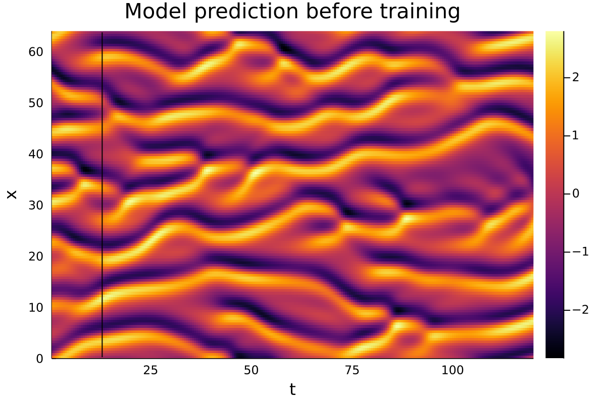

# Neural closure models

## About this repo

This repository contains the code associated with my master thesis.
It includes code for:

- Generating training data by solving PDEs/ODEs:
    - Burgers' equation
    - The Kuramoto-Sivashinsky equation
    - The Lorenz '96 model
- Training a variety of ML models on the resulting data
    - Discrete models: `u(t + Δt) = model(u(t))`
    - Neural ODEs (NODEs): `du/dt = model(u)`
    - Neural closure models: `du/dt = f(u) + model(u)`
    - Augmented Neural ODEs (ANODEs): `d/dt [u, h] = model(u, h)`
    - Discrete delay models: `u(t + Δt) = model(u(t), u(t - Δt), u(t - 2Δt), ..., u(t - kΔt))`

## Installation

0. Before cloning this repo, install [Git LFS](https://git-lfs.github.com/).
    This way, the down-sampled training data for the neural networks (~60MB) will be included in the repo.
1. Install [Julia](https://julialang.org/downloads/).
    This software was run with Julia version 1.7.3, although other 1.7.x versions should also work.
2. Install dependencies by launching `julia` in this folder:

    ```shell
    > cd neural-closure-models
    > julia --project=.
    ```

    and installing all dependencies by running:

    ```julia
    using Pkg; Pkg.instantiate()
    include("src/neural_closure_models.jl")
    ```

## Examples

### Example 1: a neural ODE for Burgers' equation

The following script gives an example of loading training data, creating an ML model, training it on the data, and
showing some results. Note that as is common with Julia code, there can be a significant delay when a piece of code is
run for the first time. This is especially noticeable when training models, since this requires compiling lots of code
from `Flux.jl` as well as `DifferentialEquations.jl`. However, subsequent calls to the same functions are typically
much faster.

```julia
begin
    # Load code and data
    include("src/neural_closure_models.jl")
    burgersdata = load("trainingdata/burgers.reduced.jld2")
    solutions = burgersdata["solutions"]
    parameters = burgersdata["parameters"]
    (; Δx, Δt, x⃗, t⃗, Nₓ, L, ν) = parameters
    # Create a struct containing the relevant parameters of the equation. This struct acts as the spatially discretised
    # right-hand side, i.e. the ODE `du/dt = f(u)` is a discretisation of Burgers' equation.
    f = BurgersParams(ν, Δx)
end

begin
    # Create a neural ODE, discretised with RK4
    nn = create_deep_wide_nn()
    model = DiscreteModel(
        DiscretisedODE(nn, rk4, Δt),
        "Neural ODE, discretised with rk4"
    )
    # Run inference on the model before training
    # Note: the neural networks all expect three-dimensional arrays, with the last index representing independent
    # trajectories, so when creating a single trajectory we can't use two-dimensional arrays but must use
    # three-dimensional arrays with size 1 in the last dimension.
    prediction1 = predict(model, solutions[:, 1:1, 97:97], t⃗, nothing)[:, :, 1]
    actual = solutions[:, 2:end, 97]
    println("Before training: RMSE = $(rootmeansquare(prediction1 .- actual))")
end

begin
    # Train the model. After every epoch, compute the RMSE on a validation data set
    validator = trajectory_rmse(
        model,                    # validate by computing root-mean-square errors
        solutions[:, :, 97:128],  # on trajectories 97 through 128 of the training data
        t⃗,                        #
        nothing                   # no teacher forcing
    )
    train_discrete!(
        model, t⃗, solutions[:, :, 1:96];              # take all x-coordinates, all time stamps, and solutions 1 through 96

        # only the first three arguments are required, the remainder is optional
        exit_condition = ExitCondition(200, nothing), # 200 epochs, no early stopping
        penalty = NoPenalty(),                        # no regularisation term
        validation = validator,                       # validate as defined above
        batchsize = 8,                                # train on batches of 8 trajectories
        opt = ADAM(0.01),                             # use ADAM optimiser with learning rate 0.01 (default = 0.001)
        loss = Flux.Losses.mse,                       # use mean-square error as a loss function for training
        verbose = true,                               # print progress bars and other info during training
        teacherforcing = 0                            # no teacher forcing
    )
    # Run inference again with the model which is now trained, and plot the actual solution as well as the predictions
    # before and after training. Note that this is just an example, and to obtain truly accurate models far more
    # training epochs are required.
    prediction2 = predict(model, solutions[:, 1:1, 97:97], t⃗, nothing)[:, :, 1]

    println("After training: RMSE = $(rootmeansquare(prediction2 .- actual))")
end

begin
    plot1 = heatmap(t⃗[2:end], x⃗, actual, xlabel="t", ylabel="x", title="Actual solution", dpi=200)
    plot2 = heatmap(t⃗[2:end], x⃗, prediction1, xlabel="t", ylabel="x", title="Model prediction before training", dpi=200)
    plot3 = heatmap(t⃗[2:end], x⃗, prediction2, xlabel="t", ylabel="x", title="Model prediction after training", dpi=200)

    savefig(plot1, "burgers-actual.png")
    savefig(plot2, "burgers-prediction-before.png")
    savefig(plot3, "burgers-prediction-after.png")
end

Before training: RMSE = 0.9076025
After training: RMSE = 0.10596193
```


Before training | After training
:-: | :-:
 | 

### Example 2: a pseudospectral closure model for the Kuramoto-Sivashinsky equation

```julia
begin
    # Load data
    using JLD2
    ksdata = load("trainingdata/kuramotosivashinsky.reduced.jld2")
    solutions = ksdata["solutions"]
    derivatives = ksdata["derivatives"]
    parameters = ksdata["parameters"]
    (; Δx, Δt, x⃗, t⃗, Nₓ, L) = parameters
    # Similar to the Burgers example, `f` computes the right-hand side of the base discretisation of the KS equation
    f = KSParams(Δx)
end

begin
    # Train a pseudospectral closure model for KS
    # First, create a neural network. Add the Δfwd layer to satisfy conservation of momentum.
    nn = add_Δfwd(create_deep_wide_nn())
    # Embed the neural network as a closure term inside the ETDRK4 ODE solver
    model = ks_etdrk_model(Nₓ, L, Δt, nn, 4, "ETDRK4 closure model")
    # The pseudospectral models make predictions in the spectral domain, so the training data must be Fourier-transformed
    trainingdata = fft(solutions[:, 33:63, 1:80], 1)
    actual = solutions[:, 34:273, 81]
    # Compute the model prediction before training
    prediction1 = real(ifft(predict(model, fft(solutions[:, 33:33, 81:81], 1), t⃗[33:273], nothing), 1))[:, :, 1]
    println("Before training: VPT = $(validpredictiontime(actual, prediction1)/24)")

    # Train the model and compute the new model prediction
    train_discrete!(
        model, t⃗[33:63], trainingdata;
        exit_condition=ExitCondition(250, nothing), batchsize=8
    )
    prediction2 = real(ifft(predict(model, fft(solutions[:, 33:33, 81:81], 1), t⃗[33:273], nothing), 1))[:, :, 1]
    println("After training: VPT = $(validpredictiontime(actual, prediction2)/24)")
end

begin
    # Plot the actual solution of the PDE, as well as the prediction and prediction error before and after training
    ts = t⃗[34:273]
    plot_args = (dpi=200, xlims=extrema(ts), ylims=(0, L))
    plot1 = heatmap(ts, x⃗, actual, xlabel="t", ylabel="x", title="Actual solution"; plot_args...)
    plot2 = vpt_heatmap(ts, x⃗, actual, prediction1, xlabel="t", ylabel="x", title="Model prediction before training"; plot_args...)
    plot3 = vpt_heatmap(ts, x⃗, actual, prediction2, xlabel="t", ylabel="x", title="Model prediction after training"; plot_args...)
    plot4 = vpt_heatmap(ts, x⃗, actual, prediction1, xlabel="t", ylabel="x", title="Model prediction error before training", diff=true; plot_args...)
    plot5 = vpt_heatmap(ts, x⃗, actual, prediction2, xlabel="t", ylabel="x", title="Model prediction error after training", diff=true; plot_args...)

    savefig(plot1, "ks-actual.png")
    savefig(plot2, "ks-prediction-before.png")
    savefig(plot3, "ks-prediction-after.png")
    savefig(plot4, "ks-error-before.png")
    savefig(plot5, "ks-error-after.png")
end

Before training: VPT = 1.0833333333333333
After training: VPT = 3.7083333333333335
```


Before training | After training
:-: | :-:
 | 
 | 

The folder `test/training/` contains more examples for training different types of models with different training data.
